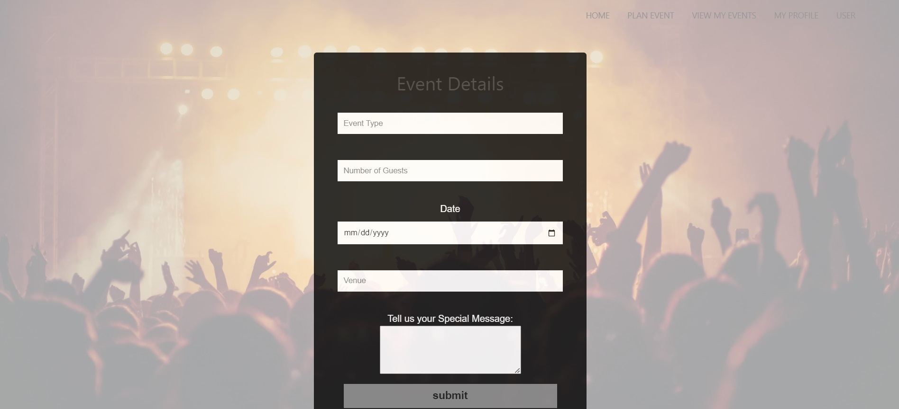

# Event Planning System

This event planning system is designed to assist event organizers in managing various aspects of event planning, including scheduling, budgeting, attendee management, and task coordination. Built using the Java programming language and following the MVC (Model-View-Controller) architecture, this system provides a structured and efficient approach to event management.

